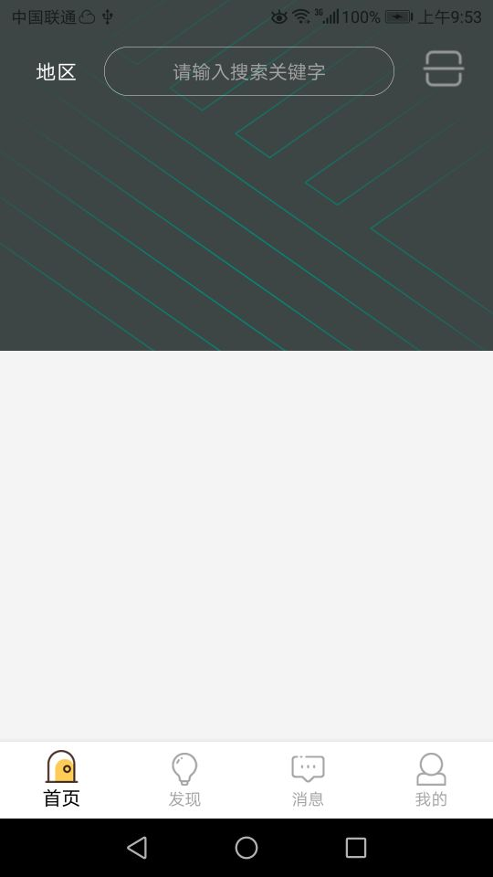

此项目是在轮子哥的[模板工程](https://github.com/getActivity/AndroidProject)上进行重构的，初衷是为了删除一些自己不熟悉的框架而添加一些自己熟悉的框架，并且使用 androidX、jetpack、Kotlin，完成一个自己用起来顺手的模板工程。这也符合其开源初衷：
> 当我们日复一日年复一年的搬砖的时候，你是否曾想过提升一下开发效率，如果一个模板的项目摆在你的面前，你还会选择自己搭架构么

## 一、功能简介：

 * 登录模块使用 MVVM 框架实现，首页通过 Navigation 来实现 Fragment 控制
 * WebActivity 增加 WebView 下载文件功能
 * 首页增加城市选择，城市选择数据查看：（待提交）如果需要自定义数据，需要重写数据库类[DBManager](https://github.com/zaaach/CityPicker/blob/master/citypicker/src/main/java/com/zaaach/citypicker/db/DBManager.java)
 * 首页增加扫一扫功能，并对扫一扫结果通过 WebActivity 展示
 *  Activity 基类、 Fragment 基类封装以及部分自定义 View 编写等

## 一、项目截图：

## 三、集成框架：

> // ViewModel and LiveData
> 
> api "androidx.lifecycle:lifecycle-extensions:$rootProject.ext.lifecycle_version"
> 
> // For Kotlin use navigation-fragment-ktx
> 
> implementation "android.arch.navigation:navigation-fragment:$rootProject.ext.nav_version"
> 
> // For Kotlin use navigation-ui-ktx 
> 
> implementation "android.arch.navigation:navigation-ui:$rootProject.ext.nav_version"
> 
> // RecyclerView
> 
> api "androidx.recyclerview:recyclerview:$rootProject.ext.recyclerview"
> 
> Retrofit 网络
> 
> implementation "com.squareup.retrofit2:retrofit:$rootProject.ext.retrofit"
> 
> Gson 解析
> 
> implementation "com.squareup.retrofit2:converter-gson:$rootProject.ext.gson"
> 
> Glide 图片加载
> 
> implementation "com.github.bumptech.glide:glide:$rootProject.ext.glide"
> 
> annotationProcessor "com.github.bumptech.glide:compiler:$rootProject.ext.glide"
> 
> //城市选择  https://github.com/zaaach/CityPicker
> 
> implementation "com.zaaach:citypicker:$rootProject.ext.citypicker"
> 
> // 仿魅族banner  https://github.com/pinguo-zhouwei/MZBannerView
> 
> implementation "com.github.pinguo-zhouwei:MZBannerView:$rootProject.ext.mzBanner"
> 
> // Easy 工具类  https://github.com/yjfnypeu/EasyAndroid
> 
> api "com.github.yjfnypeu:EasyAndroid:$rootProject.ext.EasyAndroid"
> 
> // 屏幕适配 https://github.com/JessYanCoding/AndroidAutoSize
> 
> api "me.jessyan:autosize:$rootProject.ext.autosize" 
> 
> // Adapter  https://github.com/CymChad/BaseRecyclerViewAdapterHelper
> 
> api "com.github.CymChad:BaseRecyclerViewAdapterHelper:$rootProject.ext.BaseRecyclerViewAdapterHelper"
> 
> // 沉浸式状态栏颜色  https://github.com/laobie/StatusBarUtil
> 
> implementation "com.jaeger.statusbarutil:library:$rootProject.ext.statusbarutil"
> 
> // 界面侧滑 https://github.com/bingoogolapple/BGASwipeBackLayout-Android
> 
> implementation "cn.bingoogolapple:bga-swipebacklayout:$rootProject.ext.swipebacklayout"
> 
> // 键对值存储器  https://github.com/orhanobut/hawk
> 
> implementation "com.orhanobut:hawk:$rootProject.ext.hawk"
> 
> // 版本更新
>
> implementation "com.github.yjfnypeu:UpdatePlugin:$rootProject.ext.updatePlugin"
>
> //城市选择
> implementation "com.zaaach:citypicker:$rootProject.ext.citypicker"
> 
> // 扫一扫
> 
> implementation "com.mylhyl:zxingscanner:$rootProject.ext.zxing"

## 四、联系方式：
 1. 本人邮箱：weixing9920@163.com
 2. [轮子哥：https://www.jianshu.com/u/f7bb67d86765](https://www.jianshu.com/u/f7bb67d86765)

## 五、下一步计划：
 * 新增全部网络提醒
 * 新增年月日选择对话框
 * 解决城市选择自动定位异常以及查看扫一扫框架api警告原因